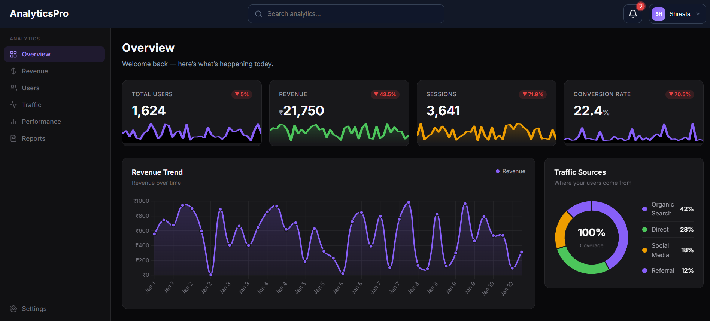
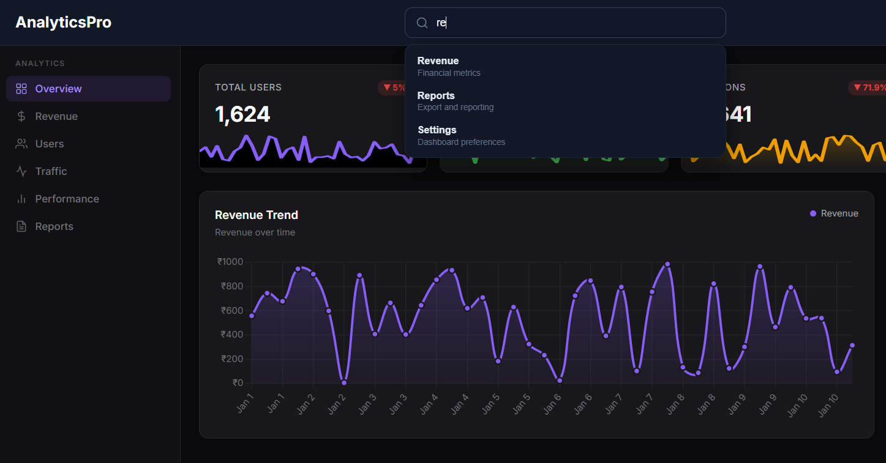

# 📊 Analytics Dashboard

A full-stack Analytics Dashboard built using Vue.js, Express.js, MongoDB, JWT Authentication, Docker, and Nginx.

This application provides real-time analytics visualization, user authentication, KPI monitoring, revenue tracking, user analytics, traffic insights, and secure access control.

---

## 🚀 Features

### Authentication
- User Registration
- User Login
- JWT Authentication
- Protected Routes
- Logout Functionality

### Dashboard
- KPI Statistics Cards
- Revenue Analytics Chart
- Users Analytics Chart
- Traffic Distribution Chart
- Analytics Data Table
- Search & Filter Functionality

### Backend
- REST API Architecture
- MongoDB Integration
- JWT Token Verification
- Password Hashing using bcryptjs
- Analytics Data Aggregation

### DevOps
- Dockerized Frontend
- Dockerized Backend
- MongoDB Container
- Docker Compose Setup
- Nginx Reverse Proxy

---

## 🛠️ Tech Stack

### Frontend
- Vue 3
- Vue Router
- Axios
- Chart.js
- Lucide Icons

### Backend
- Express.js
- Node.js
- MongoDB
- Mongoose
- JWT
- bcryptjs

### DevOps
- Docker
- Docker Compose
- Nginx

---

## 📂 Project Structure

```text
analytics-dashboard/
│
├── frontend/
│   ├── src/
│   │   ├── components/
│   │   ├── views/
│   │   ├── router/
│   │   ├── services/
│   │   └── App.vue
│   │
│   ├── Dockerfile
│   └── package.json
│
├── backend/
│   ├── src/
│   │   ├── controllers/
│   │   ├── models/
│   │   ├── routes/
│   │   ├── middleware/
│   │   └── config/
│   │
│   ├── Dockerfile
│   ├── server.js
│   └── package.json
│
├── screenshots/
│
├── docker-compose.yml
├── nginx.conf
├── README.md
└── .gitignore
```

---

## 📸 Screenshots

### Login Page


### Signup Page


### Dashboard Overview



### Analytics Charts


### Search Functionality



---

## 🔐 Authentication Flow

```text
User Login
    ↓
JWT Token Generated
    ↓
Token Stored in Browser
    ↓
Protected Routes Access
    ↓
Authenticated API Requests
```

---

## 📊 Dashboard Flow

```text
MongoDB
   ↓
Express API
   ↓
Analytics Aggregation
   ↓
Vue Frontend
   ↓
Charts & KPI Cards
```

---

## ⚙️ Environment Variables

Create a `.env` file inside the backend folder.

```env
PORT=5000

MONGO_URI=mongodb://mongo:27017/analytics

JWT_SECRET=your_secret_key
```

---

## 🐳 Running with Docker

### Build Containers

```bash
docker-compose build
```

### Start Application

```bash
docker-compose up
```

### Start in Detached Mode

```bash
docker-compose up -d
```

### Stop Containers

```bash
docker-compose down
```

---

## 💻 Running Locally

### Backend

```bash
cd backend

npm install

npm run dev
```

### Frontend

```bash
cd frontend

npm install

npm run dev
```

---

## 🔗 API Endpoints

### Authentication

#### Register User

```http
POST /api/auth/signup
```

#### Login User

```http
POST /api/auth/login
```

---

### Analytics

#### Dashboard Summary

```http
GET /api/analytics/summary
```

#### Analytics Trends

```http
GET /api/analytics/trends
```

#### Seed Sample Data

```http
POST /api/analytics/seed
```

---

## 🎯 Key Learning Outcomes

- Building scalable REST APIs
- JWT Authentication & Authorization
- MongoDB Aggregation Pipelines
- Vue.js State Management
- Docker Containerization
- Full-Stack Application Architecture
- Protected Frontend Routing
- Data Visualization using Charts

---

## 🚀 Future Enhancements

- Date Range Filtering
- Export Reports (CSV/PDF)
- Dark / Light Theme
- Advanced Dashboard Filters
- User Profile Management
- Role-Based Access Control
- Real-Time Analytics Updates

---

## 👩‍💻 Author

**Shruti K**

GitHub: https://github.com/shruti-kanivi/analytics-dashboard

LinkedIn: https://linkedin.com/in/shruti-kanivi

---

## 📄 License

This project is intended for learning, portfolio showcase, and demonstration purposes.